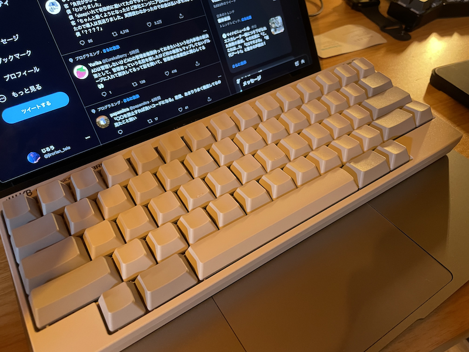

これまでにいろんなキーボードに手を出してきました。
Moonlanderをはじめとした分割キーボードは確かに体に優しく、肩凝りが圧倒的に軽減されました。
Kinesis advantage 2はエルゴノミクスキーボードの完成形と言えるほど、合理的な設計がされていると感じました。(ただし、advantage 2は完全分離型ではないので肩は普通に凝った。むしろ酷くなったかもしれない)
キーの打鍵感の観点では、やはりHHKBの方が私の好みでした。
それからやっぱり見た目がめちゃくちゃオシャレ。
特に無刻印の白がオシャレだなと思いました。

で、買いました。2台目のHHKB Professional HYBRID type-Sです。

