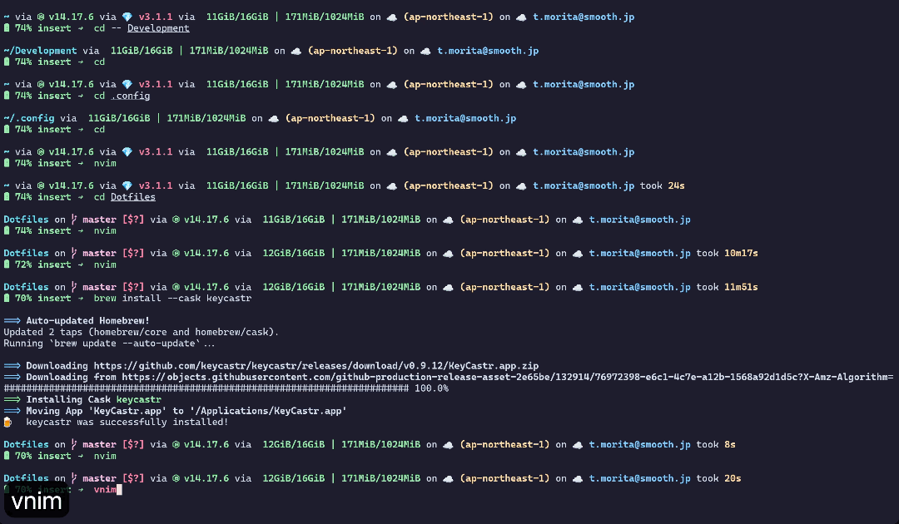

私は今年からエンジニアとして働いていますが、コードを書くには主にNeovimを使っています。
Vim (Neovim)は一般的には「太古の使うのが難しいNerdなエディタ」として認識されています(少なくとも私の会社では)。
それは、操作のクセが強いこと(コマンドライン操作が前提なのでマウスを使わない)、プラグイン無しでは他のエディタと比べると機能が少ないなど、プラグインの導入が難しい、などが理由としてあげられるのではないでしょうか。

一方で、Vimには「世界じゅうの有志の方によって作られたプラグインがある」ことが大きなメリットの一つではないでしょうか。
今回は数あるプラグインの中から、特に私がお世話になっているnvim-telescopeを紹介したいと思います。

telescopeはfuzzy finder（あいまい検索）プラグインのひとつです。
fzf.vimも有名ですが、最近ではtelescopeのほうが使われているような気がします。
telescopeを使うと、ファイル、gitのブランチ、live grepなどについてあいまい検索できるようになります。
下のGifではgit filesについてあいまい検索にかけて```init.vim```を開いています。



これはヘビーに使わせてもらっているプラグインで、かなりおすすめです。
導入方法やキーバインド設定などは本家のレポジトリから↓

[nvim-telescope/telescope.nvim](https://github.com/nvim-telescope/telescope.nvim)

