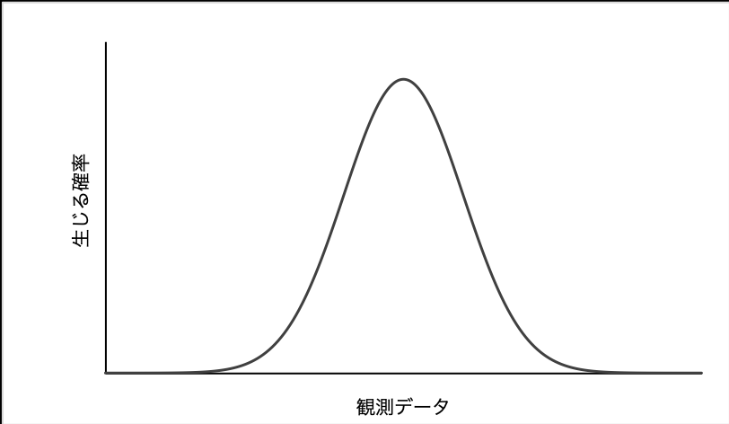
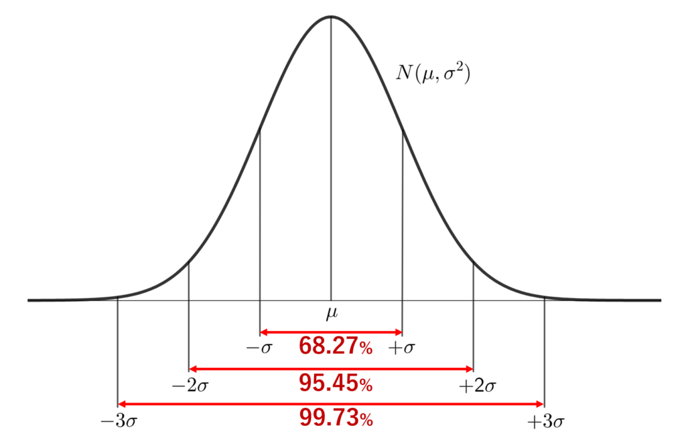

# 「有意差なし」と言ってはならない

AB テストでよく用いられる χ^2
検定を行った結果、有意差がみられない結果が得られたとする。このときに「差はない」として議論を進めてはいけない。

従来と新施策で ABテストを行った結果、有意差が見られなかったとする。このときに「従来と新施策で差がないんだな。差がないんだったらせっかく新しく施策考えたし、新しい施策を採用しよう！」と意思決定するのは間違えていることが知られている。（統計学的には帰無仮説を棄却しないで誤る確率が高いから（第2 種の誤り））

なので、有意差が見られなかったときは「**有意差があるとは言えない**」と消極的にしか結果を述べることができず、こういった場合はおとなしく従来パターンを採用するのが一般的。

# χ^2検定

ABテストでよく使われる統計検定。χ^2分布という関数を用いた検定である。簡単に計算できるのがメリット。

以下サイトで検定を行える。

[https://www.evanmiller.org/ab-testing/chi-squared.html#](https://www.evanmiller.org/ab-testing/chi-squared.html#)

検定に必要な母数の計算は以下で行える。

[https://keisan.casio.jp/exec/user/1489063696](https://keisan.casio.jp/exec/user/1489063696)

# 検定

結果を比較するときに「差がある」と結論付けるのは難しい。データのばらつきがどの程度あるか予測することができないからだ。例えば、36と37という数値をみたとき、それらに差があるかどうか判断する場合を考える。これが数学のテストの点数と聞くと、「対して差はない」と結論付けることができるが、人間の体温だった場合、「大きく差がある」と結論付けることができそうだ。このように２つの数値を見るだけでは「差がある」と結論付けることは難しい。

検定とは2つの数値の間に「差がない」と仮定（帰無仮説）して、そのあとにいろいろと計算した結果「差のない」仮説を否定する（棄却する）ことによって「差がある」と結論付ける手法である。

以下はABテストには直接役に立たなそうだが、集計結果の比較をする際につかえるかも。

# 正規分布と統計計算

## データのばらつきが気になるとき

起こりえる事象を横軸、起こりえる確率（回数）を縦軸に取ったとき、以下のような分布を正規分布という。

あらゆる自然現状は正規分布に従うとされている。

たとえば、ボードゲームのカタンでは自分のターンの最初にさいころ2つを振る。このとき、もっとも出やすい値は7である。その次に6，8の出る確率が高い。さいころを2つ振る場合には、上記正規分布も最も値が高いところが7でその分布は7を軸に左右対称である。（カタンのさいころ目を示す板は7が最も強調されたフォントで記されており、確率が高い順にフォントが強調されている）

この正規分布がある値Xで左右対称になるとき、このXを**平均値**という（カタンの場合は平均値は7）。正規分布においては平均値が代表値（その分布を代表するような数値）として採用されることが多い。

データを比較するとき、平均値だけで議論することは少ない。データのばらつきも気になる。**標準偏差**はデータのばらつきを表す指標の一つでこれは正規分布について平均値を中心に左右でデータ全体の68.27 %を含めるようにしたときに決まる値（下の図ではσが標準偏差）。標準偏差が大きい場合は、正規分布平らになり、データのばらつきが大きい状態である。逆に標準偏差が小さい場合は正規分布がシャープになり、データのばらつきが小さい状態である。

代表値とばらつきを用いることでデータの比較を行うことができる。

しかし、対象としている事象が正規分布に従わない場合は、これらの値を使って議論することができない。これらの値は正規分布を前提として使われるからだ。

例えば、 年収のように正規分布に従わないものについてはこれらの指標を使うことができない（事実、年収では中央値が代表地として採用されることが多い）。

## データの平均値のばらつきが気になるとき

ある事象からX個のサンプルを取り出してその平均を算出して記録する。この作業をn回繰り返したときには平均値はn個記録されているが、そのn個の分布は**必ず正規分布に従う**。nを限りなく大きくしたとき、n個で構成されるデータの分布の平均値はある事象の全体の平均値に限りなく近づくことが知られている。これを**中心極限定理**という。

「ある事象からX個のサンプルを取り出してその平均を算出して記録する」作業を繰り返して得られた分布は必ず正規分布になるので、この分布については平均値と標準偏差を使って議論することができる。この分布のもとで計算された標準偏差を**標準誤差**という。

標準偏差はデータ全体のばらつきを気にするときに使う指標で、標準偏差はデータの平均値のばらつきが気になるときに使う指標である。

# Reference
- [正規分布とは？簡単にわかりやすく標準偏差との関係もガウス分布に関して解説｜いちばんやさしい、医療統計](https://best-biostatistics.com/summary/normal_dist.html)
- [正規分布の期待値(平均)・分散・標準偏差とその導出証明 | 数学の景色](https://mathlandscape.com/normal-distrib-ev/)
