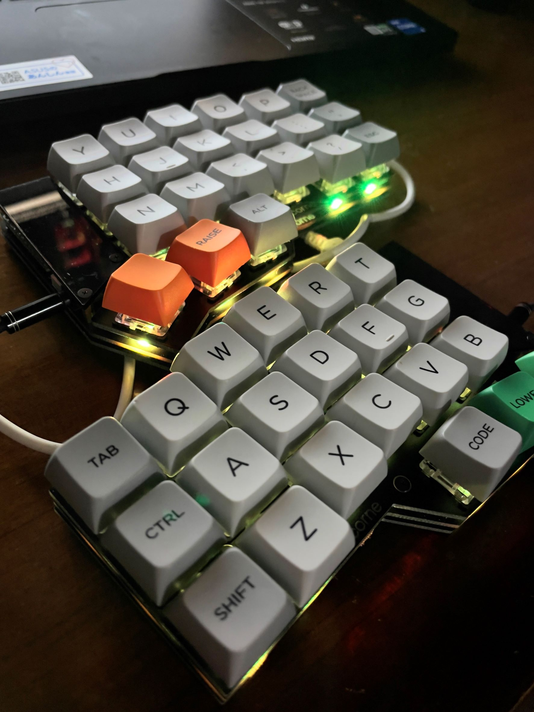

## 購入まで
これでキーボード5台目です....
以前から分割キーボードを愛用しております。
初めは遊舍工房で売っていたergo42を使っていました。
その次はergo dash、その次はmoonlander....

なぜこんなにも分割キーボードにこだわるのかと言うと分割キーボードはやはり肩凝りが大分抑制されるからですね。
HHKBも持っていて、これもとても打ちやすいんですがやっぱり肩凝りがひどくなってしまいます。

で、今回買ったのは40%キーボードのcorne cherry。
小さくて省スペースでいいなあと思って買いました。
Kochi keyboardで購入しました！ 購入後1時間以内に発送されており、「はやっ！」って思いました。

[Kochi keyboard](https://kochikeyboard.stores.jp/)

## 制作
表面実装の小さなパーツが多いし、LEDもあるので自作キーボードの中でも難易度は高めなんじゃないかと思いました。
特にLED素子は熱に弱いらしく、温度調節ができるハンダゴテでなければ間違いなく破壊されるとのこと。
自分は温調ハンダゴテと鉛フリーのハンダを持ってたのでそれらを使いました。

## 完成
普段、研究等でハンダ付けを良く行なうので制作にそこまで時間はかかりませんでした。ざっと2時間程度でしょうか。

## 使ってみて
40%キーボードってキーが少なすぎて大変じゃないの？って思ってたけど、全然いける。
なによりも本体が小さいのでほぼ手のひらに収まってしまう。
Moonlanderはキーボードが大きすぎて(外国人用？)、手が痛くなってたけどこのcorne cherryは超快適。
おすすめです。

## 結論
分割自作キーボードはかなりいい。

