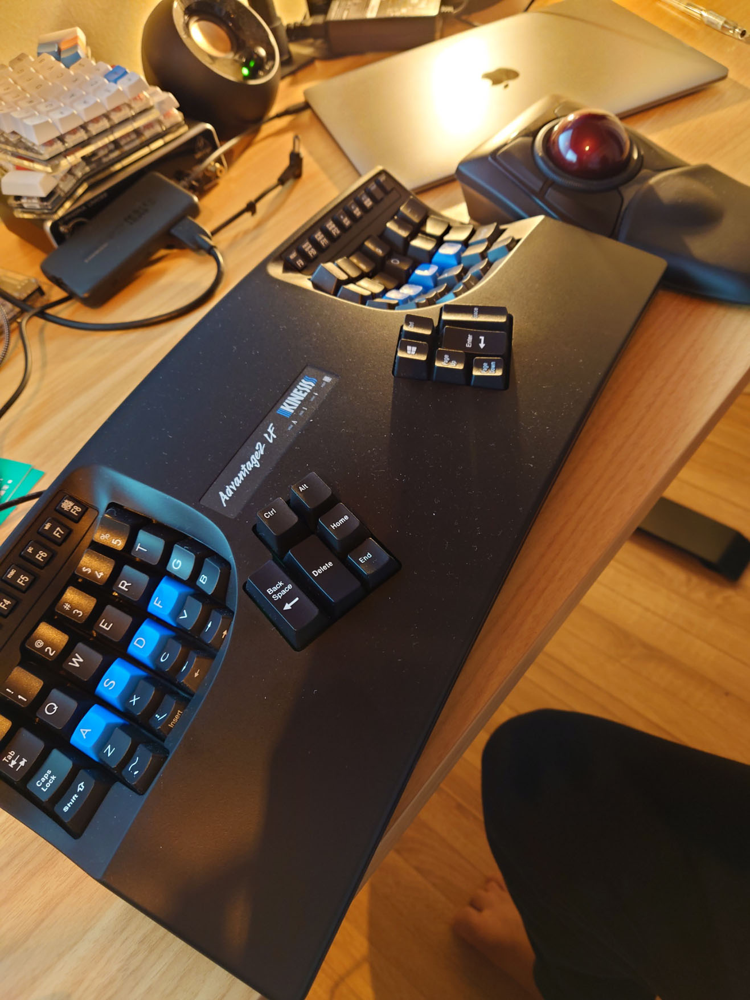

前回Moonlanderのレビューで記した通り、このキーボードは大きくて上側のキーを押すにはホームポジションから手を動かす必要があります
これを繰り返していると手の甲が痛くなってきてきます。
なんとかこれを解消できないかとMoonlanderの親指部をチルトできる治具を3Dプリントしたりといろいろやってみましたが、あまり満足できませんでした。

それで、以前から気になっていたkinesis advantage 2を購入しました。
このキーボードは今では有名になってきた分割キーボードの祖先にあたるもので、キーボードは完全に分割されていないものの様々な部分でエルゴノミクスデザインになっています。

まず、キーボード全体がお椀状にくぼんでいること。
手を開閉すると指は弧の軌跡を描きます。
キーボードがお椀状にくぼんでいることで、手の自然な動きでキーボードを打鍵することができます。
そして、キーボード全体がくぼんでいることで、Moonlanderなどの分割キーボードでは届かなかった数字キーに指が届きます。

そしてもう一つすごいと思ったのは、キーボードがお椀状に均一にくぼんでいるのではなく、指の長さに応じてキーボードのくぼみ具合が異なっていることです。
例えば、指の中では中指が最も長いですが、中指を置くDキーあるいはKキー列は他の列よりもくぼんでいます。
指の長さに応じてキーボードに段差が付いているため、短かくて力の入りにくい小指でもキーを打鍵することが容易です。

デメリットをあげるとすれば、完全に分割されていないことですかね。
Moonlanderや他の自作キーボードは完全に分割されており、その間に本などの物を置くことができましたが、kinesis advantageは分割されていないため、これができません。 
また、本体がめちゃくちゃでかいので、持ち運びはできません。
私は現在1台しか持っていないため、毎日持ち運んでいますがめちゃくちゃキツいです。
そのうち、家用にもう1台買おうと思っています。

とにかく、全体的にはめちゃくちゃ満足しています。

